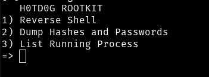

# ROOTKIT-RING3
Rootkit Ring3 for Linux in progress

To install the rootkit, follow these steps:
1. First, make sure that the installation file `rkinstall.sh` has executable permissions, if not, type the command `chmod +x rkinstall.sh`:

2. Run the installation script as root:

3. Open another terminal session as root and enter the following command to start the rootkit process (which operates invisibly within the system):

4. You'll be prompted to enter a password. Use `ring3` to access the rootkit menu.

5. Once you've accessed the menu, you'll see various options available.

Remember, this rootkit is intended for educational purposes and study only. Use it responsibly and good luck!

# H0TD0G 0.2

1. Now the rootkit layout is more interactive and beautiful.
2. Now has a new function that you can disable IPTables

